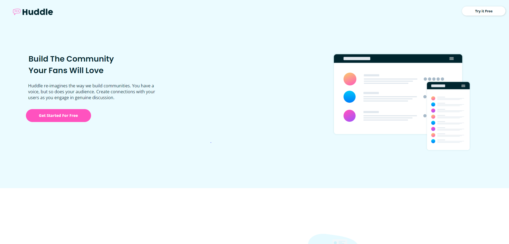

# Frontend Mentor - Huddle landing page with alternating feature blocks solution

This is a solution to the [Huddle landing page with alternating feature blocks challenge on Frontend Mentor](https://www.frontendmentor.io/challenges/huddle-landing-page-with-alternating-feature-blocks-5ca5f5981e82137ec91a5100). Frontend Mentor challenges help you improve your coding skills by building realistic projects. 

## Table of contents

- [Overview](#overview)
  - [The challenge](#the-challenge)
  - [Screenshot](#screenshot)
  - [Links](#links)
- [My process](#my-process)
  - [Built with](#built-with)
  - [What I learned](#what-i-learned)
  - [Continued development](#continued-development)
  - [Useful resources](#useful-resources)
- [Author](#author)
- [Acknowledgments](#acknowledgments)

**Note: Delete this note and update the table of contents based on what sections you keep.**

## Overview

### The challenge

Users should be able to:

- View the optimal layout for the site depending on their device's screen size
- See hover states for all interactive elements on the page

### Screenshot




### Links

- Solution URL: [Check out the code](https://huddle-landing-page-with-alternating-feature-block-thecoderguru.vercel.app/)
- Live Site URL: [Visit the live site here](https://github.com/TheCoderGuru/huddle-landing-page-with-alternating-feature-block.git)

## My process

### Built with

- Semantic HTML5 markup
- CSS custom properties
- CSS Grid
- Mobile-first workflow


### What I learned

This challenge gave me a bit of trouble since I could not decide whether to use css grid or flexbox to achieve the "side to side" layout in the hero section. Eventually after much pondering I decided to use css grid which was not the best way since I should have used css flexbox because the content was either being aligned on the x axis or the y axis, however it achieved the layout. 

In terms of the three sections below, the description was almost touching the margin of the page thus I decided that the best way would be to apply a max-width on the container itself in order to achieve the layout seen in the desktop version. This meant that I could use the css property ```max-width``` however while watching one of Kevin Powell's css videos he mentioned Stephanie Eckles' [modern css solutions](https://moderncss.dev/),  this intrigued me to give it a try using the modern css approach of the css property ```max``` which did not turn out too well and just left me more confused however it got me thinking exactly how I can achieve the layout without using max to manipulate the width. It was at this moment when I decided to try using the logical property ``inline-size`` which represents width hence the name "inline" [ <- - -> ] and it did solve the problem of the description being too long and less readable. 

Lastly, the lessons learnt while doing this challenge and for future challenges are to always ensure that your paragraphs have a bit of ```line-height``` to make it easier to read in addition to using rems or ems instead of pixels since it allows for adaptablity across various devices being used by the end-user.


### Continued development

I plan to only use css flexbox when content needs to be aligned in only one axis instead of using flexbox, secondly I am a bit confused with the ```order``` and ```flex-basis``` property so I plan to watch a css flexbox tutorial to get a better understanding which will help me write efficient code in my future solutions.


### Useful resources

- [CSS Tricks - CSS Grid](https://css-tricks.com/snippets/css/complete-guide-grid/) - This helped me with the flexbox concept and I am really glad to be recommend this article, will use it going forward.

- [MDN CSS Reference](https://developer.mozilla.org/en-US/docs/Web/CSS) - This is the guide to all the css properties with an indept explanation. Definitely recommend it.


## Author

- Frontend Mentor - [@TheCoderGuru](https://www.frontendmentor.io/profile/TheCoderGuru)
- Twitter - [@TheCoderGuru](https://www.twitter.com/TheCoderGuru)


## Acknowledgments

[Christopher-Adolphe](https://www.frontendmentor.io/profile/Christopher-Adolphe) for this detailed and well structured feedback which helped me to finish this challenge as close to the design as possible.

[Danilo Blas](https://www.frontendmentor.io/profile/Sdann26) for his wonderful suggestion to incorporate a box-shadow on the grid containers in addition to making the footer clickcs clickable.

